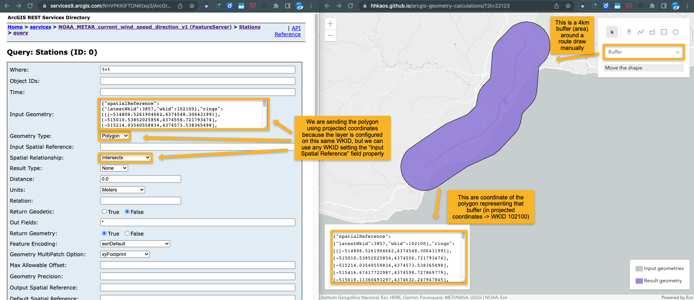

# arcgis-geometry-calculations

> **Attribution**: The original code that was used to make this app is at [developers.arcgis.com](https://developers.arcgis.com/documentation/mapping-apis-and-services/spatial-analysis/geometry-analysis/calculation/)

With this tool you can easily grab the geometry resulting from a spatial geometry calculation (buffers, intersections, unions, ...). It was made initially with the intention to help you do spatial queries within ArcGIS feature services as shown in the following video:

* [Demo video](https://youtu.be/dkEt_dz8KZA)
* [Live app](https://hhkaos.github.io/arcgis-geometry-calculations/)

> **Note**: Feel free to use [this tool to convert projected (WKID 102100) to/from geographic (WKID 4326) coordinates if needed](https://hhkaos.github.io/mercator-geographic-converter/).

The service used on that video was [Current Weather and Wind Station Data](https://hhkaos2.maps.arcgis.com/home/item.html?id=cb1886ff0a9d4156ba4d2fadd7e8a139), where you can query +5800 weather stations at [this service url](https://services9.arcgis.com/RHVPKKiFTONKtxq3/ArcGIS/rest/services/NOAA_METAR_current_wind_speed_direction_v1/FeatureServer/0).



The response of the query shown on the video was:

```json
{
  "type" : "FeatureCollection", 
  "features" : [
    {
      "type" : "Feature", 
      "id" : 1566, 
      "geometry" : 
      {
        "type" : "Point", 
        "coordinates" : [
          -4.46999999958736, 36.6699999997956
        ]
      }, 
      "properties" : {
        "OBJECTID" : 1566, 
        "ICAO" : "LEMG", 
        "OBS_DATETIME" : 1672398000000, 
        "STATION_NAME" : "Malaga (Civ/Mil)", 
        "COUNTRY" : "Spain", 
        "ELEVATION" : 5, 
        "TEMP" : 62.6, 
        "DEW_POINT" : 48.2, 
        "R_HUMIDITY" : 59, 
        "WIND_DIRECT" : 320, 
        "WIND_SPEED" : 13, 
        "WIND_GUST" : 0, 
        "WIND_CHILL" : null, 
        "VISIBILITY" : 10000, 
        "PRESSURE" : 1027.9, 
        "SKY_CONDTN" : "Ceiling and Visibility are OK", 
        "WEATHER" : "No significant weather present at this time.", 
        "REMARKS" : null, 
        "HEAT_INDEX" : null, 
        "LATITUDE" : 36.67, 
        "LONGITUDE" : -4.47, 
        "FLT_CATEGORY" : "VFR"
      }
    }
  ]
}
```
